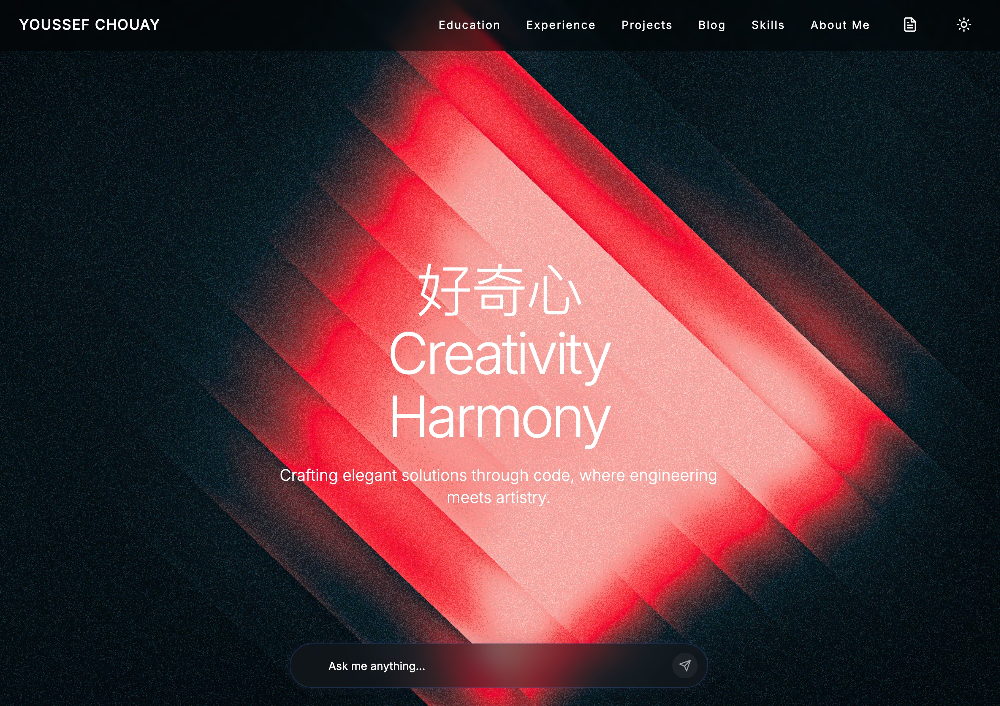
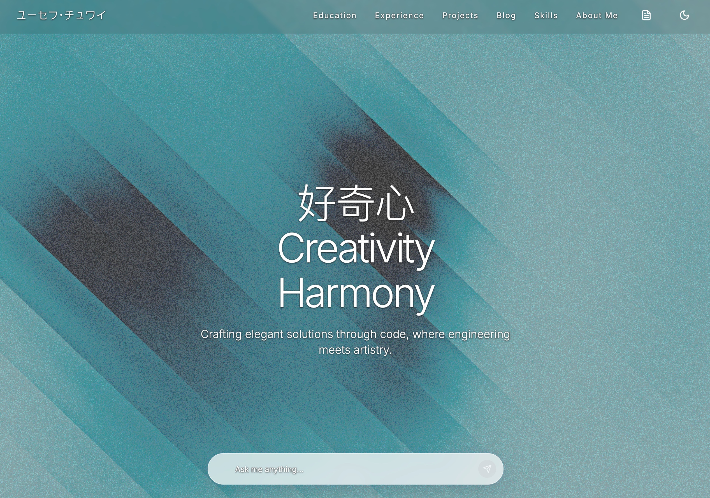

# Youssef Chouay — Portfolio

This is a simple project to showcase my portfolio and have a big of fun! It's built using Next.js 14 with Tailwind CSS, Framer Motion animations, and an AI chat powered by OpenAI + Supabase (RAG). Analytics via PostHog.

---

## How It Looks

---

## Features

- Next.js 14 App Router with TypeScript
- Tailwind CSS styling + custom animations
- Framer Motion interactions
- AI chat with OpenAI + Supabase similarity search (RAG)
- PostHog analytics
- Mobile-first, responsive design

---
