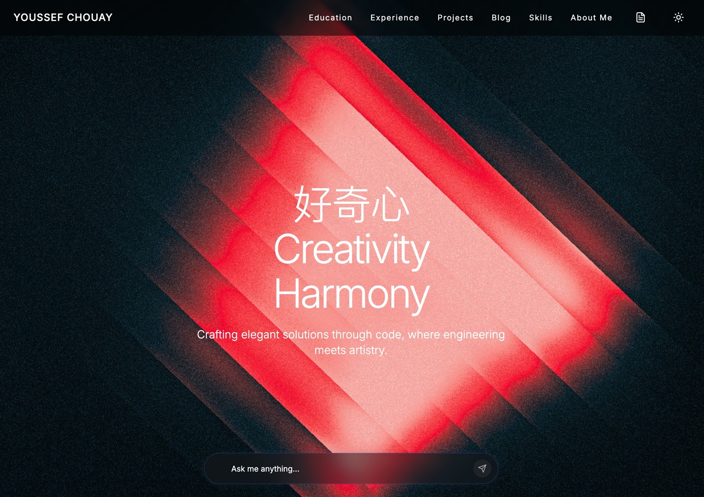
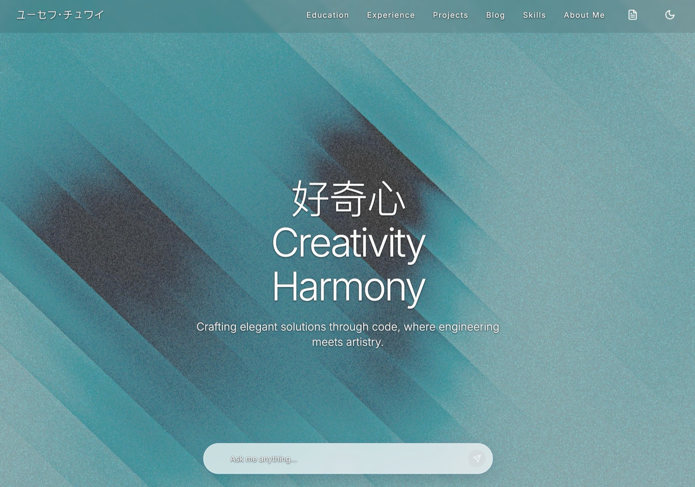

# Youssef Chouay — Portfolio

This is a simple project to showcase my portfolio and have a big of fun! It's built using Next.js 16 with Tailwind CSS, Framer Motion animations, and an AI chat powered by OpenRouter. Analytics via PostHog.

---

## How It Looks

---

## Features

- Next.js 16 App Router with TypeScript (React 19)
- Tailwind CSS styling + custom animations
- Framer Motion interactions
- AI chat powered by OpenRouter with usage/cost telemetry
- PostHog analytics
- Mobile-first, responsive design

---
